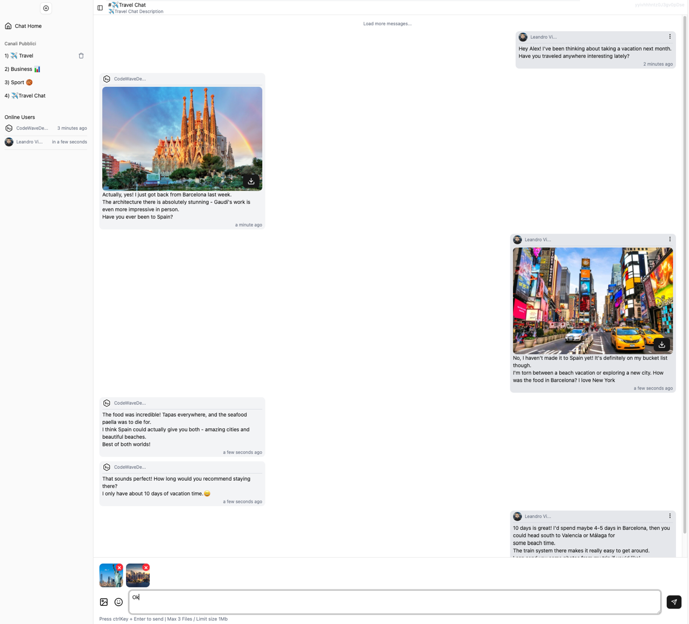
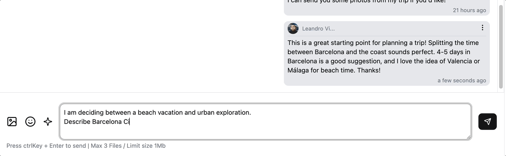
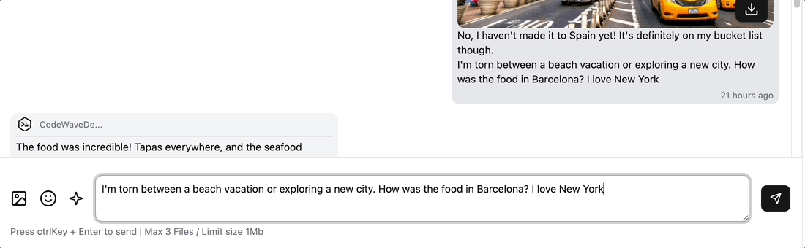
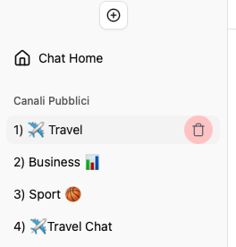
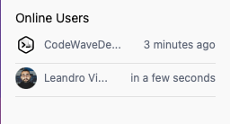
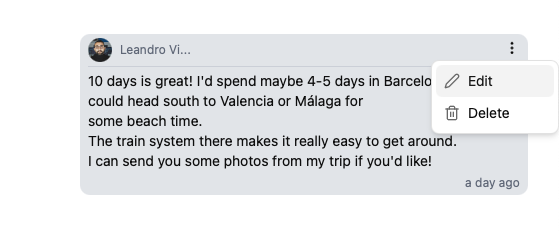
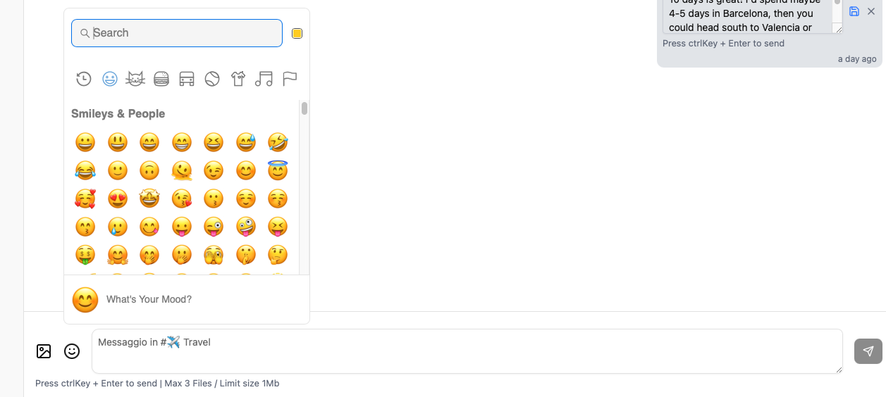
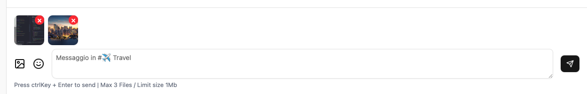

# Firebase Chat Test App

This is a simple Firebase-based chat application designed to demonstrate real-time communication using Firebase services.

[Demo Link](https://chat-test-firebase-app.web.app)




Features:

### AI Features

##### Generate Text with selected prompt:

## 

##### Re-Write selected text:

## 
---

### APP Features

##### Add e Delete Channels:

## 

##### OnLine Users e Offline Users:

## 

##### Edit e Delete Message:

## 

##### Emoj:

## 

##### Multi-Upload File:

## 

## Prerequisites

Before you begin, ensure you have the following installed:

- [Node.js](https://nodejs.org/) (LTS version recommended)
- [Firebase CLI](https://firebase.google.com/docs/cli) (`npm install -g firebase-tools`)
- A Firebase project set up in the [Firebase Console](https://console.firebase.google.com/)

## Setup Instructions

1. **Clone the Repository**  
   Clone this repository to your local machine:

   ```bash
   git clone https://github.com/your-username/chat-test-firebase-app.git
   cd chat-test-firebase-app
   ```

2. **Install Dependencies**  
   Install the required dependencies:

   ```bash
   npm install
   ```

3. **Firebase Login**  
   Log in to your Firebase account:

   ```bash
   firebase login
   ```

4. **Initialize Firebase**  
   Initialize Firebase in your project directory:

   ```bash
   firebase init
   ```

   - Select the Firebase services you want to use (e.g., Hosting, Firestore, Authentication).
   - Choose your Firebase project when prompted.
   - Configure the `public` directory (e.g., `dist` or `build` if using a frontend framework).

5. **Environment Configuration**  
   Add your Firebase configuration to the project. Typically, this is found in the Firebase Console under **Project Settings** > **General** > **Your apps**. Copy the configuration and add it to your app (e.g., in a `firebaseConfig.js` file).

## Development

To start the development server, run:

```bash
npm start
```

## Firebase Deployment

To deploy the app to Firebase Hosting, use the following command:

```bash
firebase deploy --only hosting -m "Deploying Version 1"
```

## Firebase Firestore publish rules

```
firebase deploy --only firestore:rules
```

## Features

- **Real-time Chat**: Powered by Firebase Realtime Database or Firestore.
- **Authentication**: User login and registration using Firebase Authentication.
- **Hosting**: Deployed on Firebase Hosting for fast and secure delivery.

## Project Structure

```
chat-test-firebase-app/
├── public/               # Static files for Firebase Hosting
├── src/                  # Application source code
├── firebase.json         # Firebase configuration
├── .firebaserc           # Firebase project alias configuration
├── package.json          # Node.js dependencies and scripts
└── README.md             # Project documentation
```

## Resources

- [Firebase Documentation](https://firebase.google.com/docs)
- [Firebase CLI Reference](https://firebase.google.com/docs/cli)

## License

This project is licensed under the [MIT License](LICENSE).
